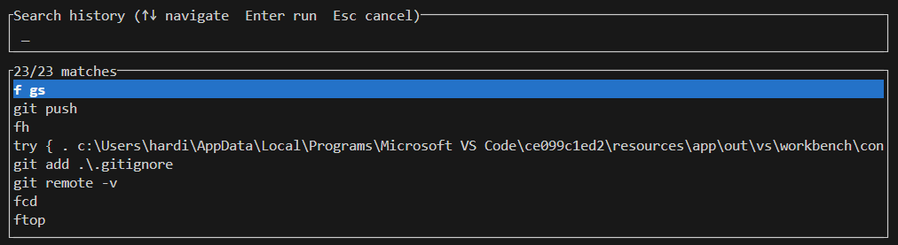
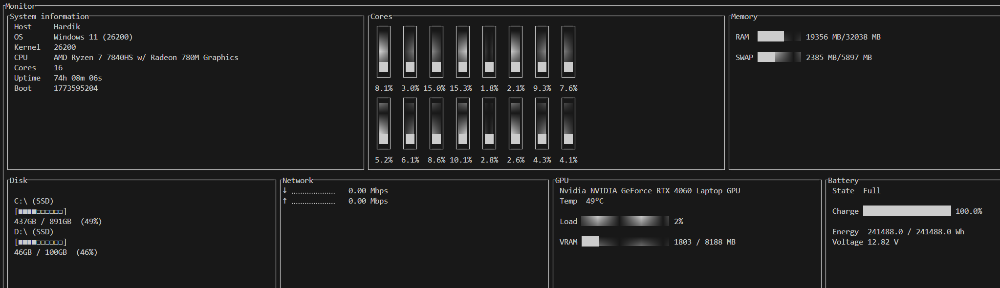
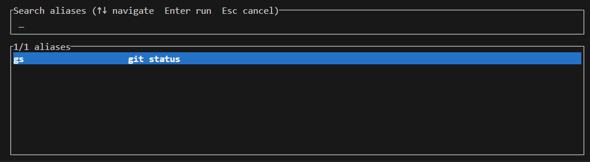

# fast

A fast, TUI-based terminal toolkit written in Rust. Includes a file browser, folder-specific command history, system monitor, and alias manager — all from one binary.

## Features

### File Browser (`fcd`)
3-column Miller-style file browser with preview. Press Enter to `cd` into the selected directory.


### History (`fh`)
Per-directory command history. Tracks what you run in each folder and lets you pick & re-run from a TUI.



### System Monitor (`ftop`)
Live dashboard showing CPU, RAM, disk, network, GPU, and battery info.



### Aliases (`f <name>`)
Save, list, and run custom command aliases from a TUI picker.



## Install

### PowerShell (from source, needs Cargo)

```powershell
.\install.ps1
```

### PowerShell (pre-built binary, no Cargo)

Place `fast.exe` next to `install-bin.ps1`, then:

```powershell
.\install-bin.ps1
```

### Bash / Zsh (from source, needs Cargo)

```bash
bash install.sh
```

## Usage

After installation, reload your shell and use the shortcuts:

| Command | Description |
|---------|-------------|
| `fcd` | File browser — `cd` into selected directory |
| `fh` | Folder-specific command history picker |
| `ftop` | System monitor |
| `f <alias>` | Run a saved alias |
| `fast alias add <name> <cmd>` | Save an alias |
| `fast alias rm <name>` | Remove an alias |
| `fast alias list` | List all aliases |
| `fast help` | Show help |

## File Browser Keys

| Key | Action |
|-----|--------|
| `↑` / `↓` | Move within focused column |
| `→` | Move focus right / navigate into directory |
| `←` | Move focus left / go to parent |
| `Tab` | Toggle file preview |
| `Enter` | `cd` to highlighted directory and exit |
| `r` | Reset to starting directory |
| `q` | Quit |

## Requirements

- **From source:** [Rust](https://rustup.rs) and Git
- **Pre-built:** Windows only (via `install-bin.ps1`)

## License

MIT
